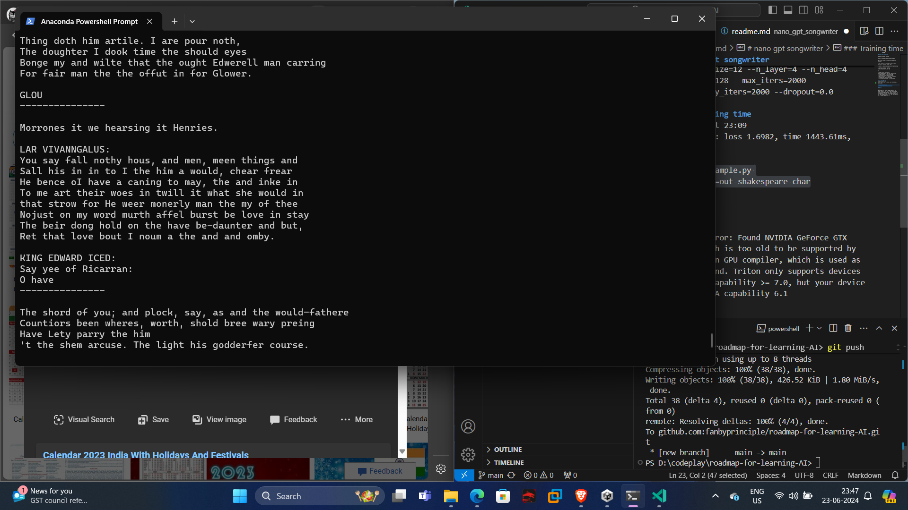

# ROADMAP TO AI

This repository aims to compile some of the best tutorials available on youtube ( or otherwise) to learn AI at a fundamental level.

# day 1 

## Training Nanogpt

This is the final repository made from karpathy tutorial.

https://www.youtube.com/watch?v=XS8eRtlcCGU

# day 2

## Understanding stacking of targets

reading attention is all you need paper.

# day 3

working on speech transcription using google recognition api.

# day 4

hugging face wave vec. Understanding th ebigram model.

