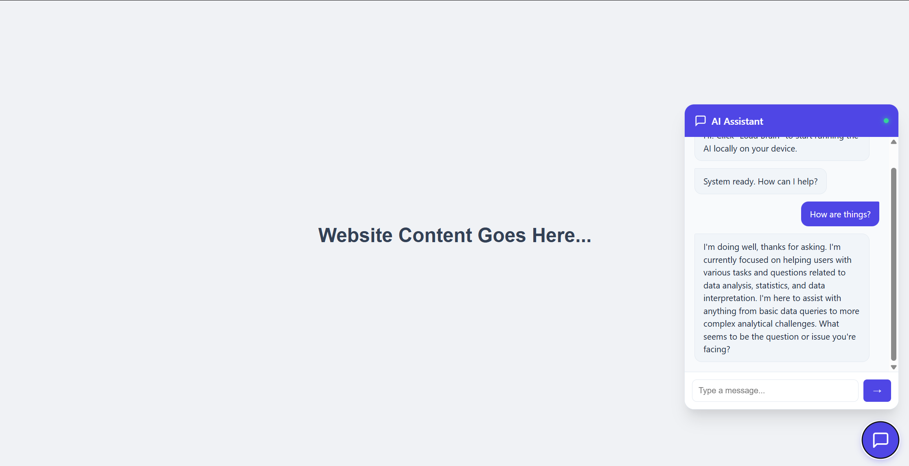
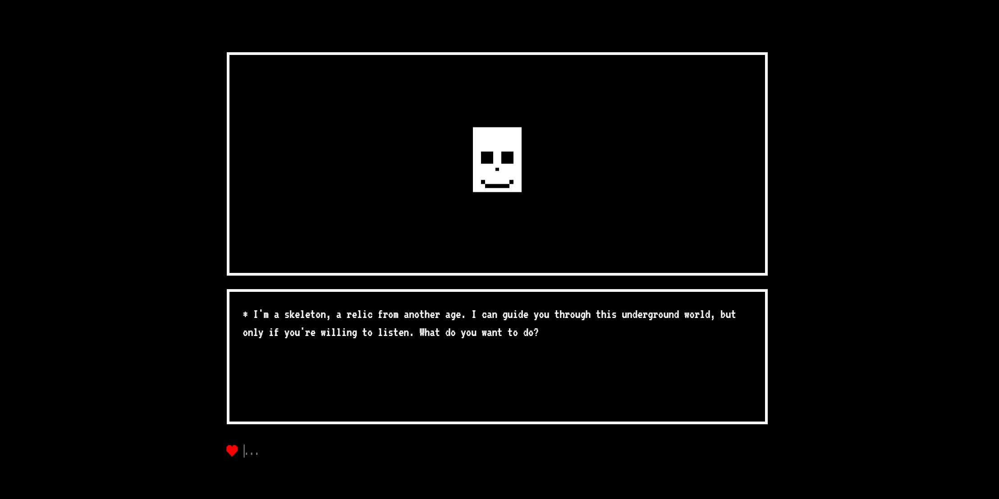

# UNDERTALK SLM

Tiny browser thing where a skeleton talks to you using a local LLM.

Read the medium article here: - 

https://medium.com/@fanbyprinciple/slms-with-js-running-smol-llms-entirely-in-your-browser-4cbc8b164940?postPublishedType=initial

I made a simple project to try out running a small LLM entirely in the browser using WASM. The model talks like a quirky skeleton in a retro pixel-style chat, kind of like an old RPG. It’s mostly JavaScript, WebAssembly, and a tiny 135M parameter model running fully on the client—no server involved.

This helped me get a better grasp of WASM loading and streaming inference inside the browser, plus some basics on managing chat state and UI updates. Sharing it here in case anyone else wants a minimal example of local LLM usage and WASM integration.

## What is this project?

- Undertale‑ish chat box + pixel skeleton.
- Model runs in your browser via WebAssembly, no backend.
- Character talks in short, lowercase, slightly cursed sentences.

## Stack

- HTML / CSS / vanilla JS
- Font: VT323 (Google Fonts)
- LLM runtime: Wllama
- Model: SmolLM2‑135M‑Instruct Q8_0 (GGUF) in `models/`

## Setup

run `setup.py`. This does the following: -

1. Put the GGUF model in `./models/`.
2. Put the Wllama JS/WASM files in `./js/wllama/` (paths match `index.html`).
3. Run any static server from the project root, e.g.:

python -m http.server 8000

4. Open `http://localhost:8000/` in a modern browser.

## How to use

- Click **START GAME**.
- Wait for the model to load (you’ll see % progress).
- Type something, hit Enter.
- Skeleton replies. You question your life choices. Repeat.

## Tweaking

- Change the character rules in `SYSTEM_PROMPT` inside `index.html`.
- Edit `normalizeResponse` if you don’t want it to force lowercase / length / `?`.
- Swap out the SVG skull if you have better pixel art skills than this repo.

## Notes

- First load is chunky because the model file is big.
- All inference is local. If it’s slow, your CPU is screaming, not the code.

## linked in blurb

Browser-based inference is no longer a toy concept. I spent the weekend experimenting with Wllama (a WASM wrapper for llama.cpp), and the performance on consumer hardware is genuinely surprising.

We aren't talking about calling an OpenAI API here. This is a 360M parameter model (SmolLM2) running entirely client-side, offline, inside a Web Worker.

The architecture is fascinating:

C++ to WASM: It uses Emscripten to compile llama.cpp’s matrix multiplication kernels into WebAssembly.

SIMD Support: It leverages 128-bit SIMD instructions directly in the browser for vectorized math operations (crucial for acceptable token generation speeds).

Non-blocking Inference: The heavy lifting happens in a separate thread (Web Worker), keeping the DOM interactive even while the CPU is pinned.

Why this matters:

Zero Latency: Once loaded, there is no network round-trip.

Privacy: No data leaves the user's device. GDPR compliance becomes architectural, not legal.

Cost: You offload the compute cost from your GPU clusters to the user's device.

I built a drop-in chat widget that handles the model quantization, caching (via OPFS), and inference loop.

Code and technical breakdown in the article below. 👇

#WebAssembly #LLM #EdgeComputing #JavaScript #AIEngineering

# creating a small llm model to work in javascript

https://ampcode.com/how-to-build-an-agent

they made an ai agent in go

https://www.youtube.com/watch?v=nBaGhHipWb0

# vibe coded an AI assistant

creating an undertale setting

