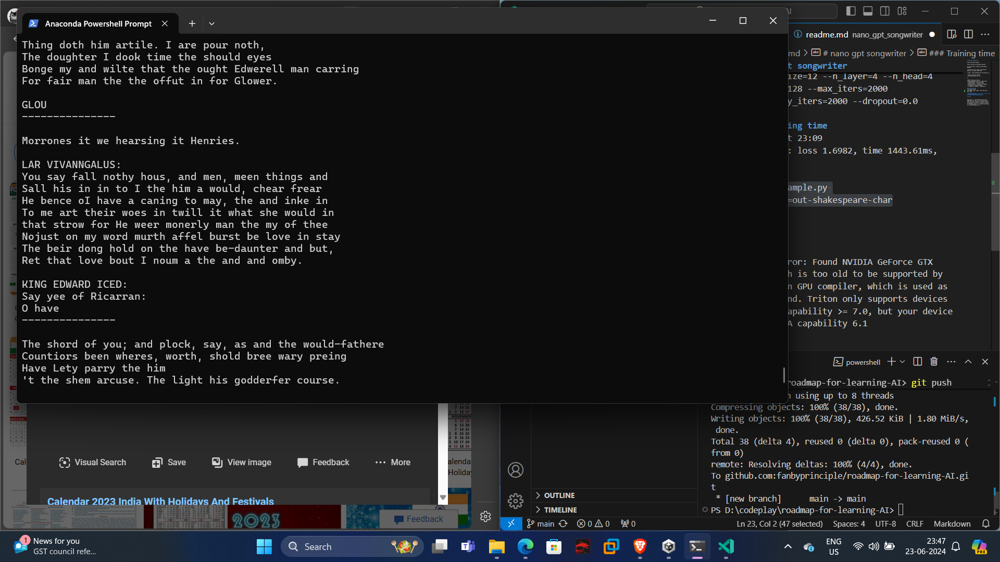

# nano gpt songwriter

Andrej Karpathy Nanogpt

https://github.com/karpathy/nanoGPT

git clone https://github.com/karpathy/nanoGPT

>pip install torch numpy transformers datasets tiktoken wandb tqdm

>python .\data\shakespeare_char\prepare.py

> python train.py config/train_shakespeare_char.py

or 

>python train.py config/train_shakespeare_char.py --device=cpu --compile=False --eval_iters=20 --log_interval=1 --block_size=64 --batch_size=12 --n_layer=4 --n_head=4 --n_embd=128 --max_iters=2000 --lr_decay_iters=2000 --dropout=0.0

### Training time
started at 23:09
step 2000: train loss 1.7640, val loss 1.8925
saving checkpoint to out-shakespeare-char
iter 2000: loss 1.6982, time 1443.61ms, mfu 0.01%

>python sample.py --out_dir=out-shakespeare-char



# Error

```
RuntimeError: Found NVIDIA GeForce GTX 1050 which is too old to be supported by the triton GPU compiler, which is used as the backend. Triton only supports devices of CUDA Capability >= 7.0, but your device is of CUDA capability 6.1
```

