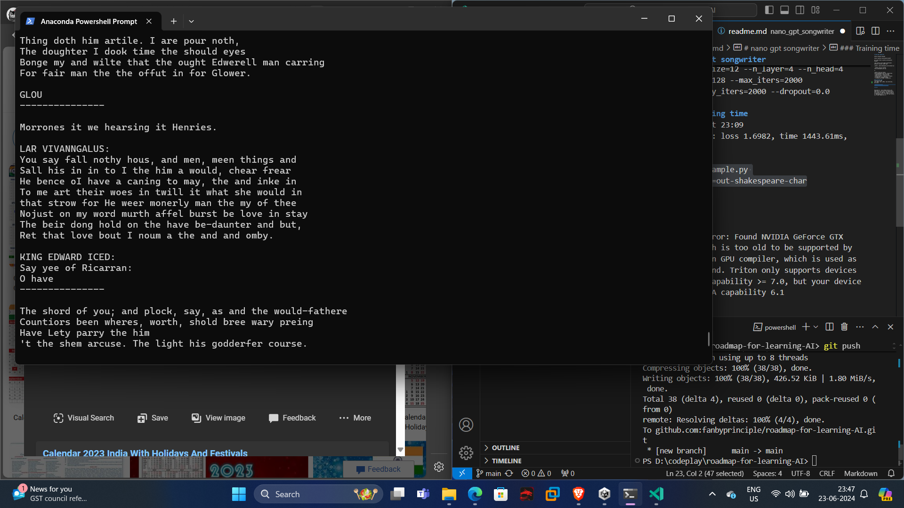

# ROADMAP TO AI

This repository aims to compile some of the best tutorials available on youtube ( or otherwise) to learn AI at a fundamental level.

# Training Nanogpt

https://www.youtube.com/watch?v=XS8eRtlcCGU

# Building GPT from scratch

